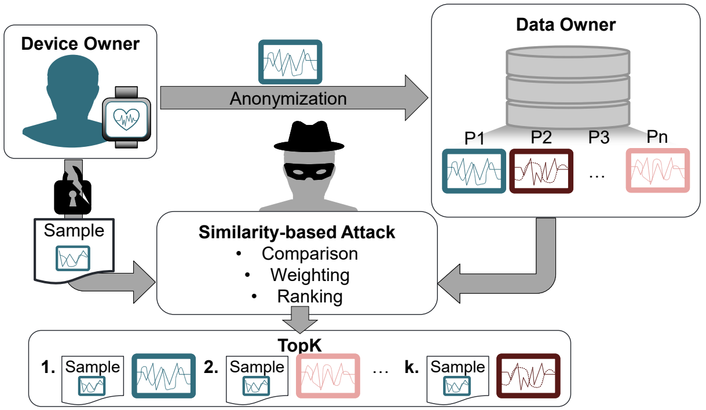
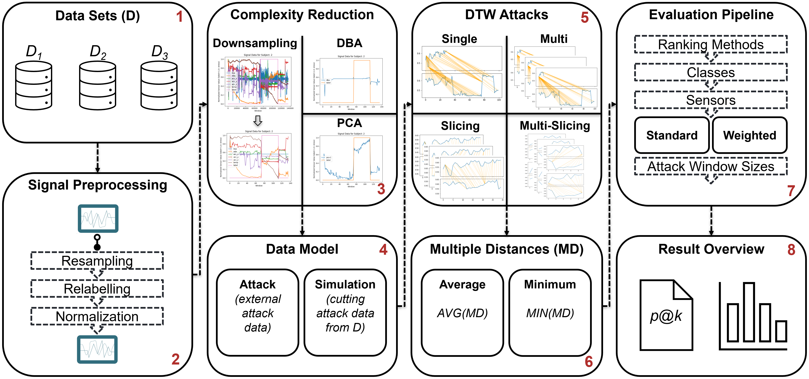

# Re-Identification Attacks on Smartwatch Health Data

This repository contains the implementation, documentation and results of the research project 
"Re-Identification Attacks on Smartwatch Health Data". Building on the findings of the project 
"[Privacy at Risk: Exploiting Similarities in Health Data for Identity Inference](https://github.com/tobiasschreieder/smartwatch-dtw-attack)", 
a novel and modular attack framework is presented, which includes four dynamic time warping based re-identification attacks.



## Contents
- [Abstract](#abstract)
- [Installation](#installation)
- [Attack Framework](#attack-framework)
- [Data Sets](#data-sets)
- [Signal Preprocessing](#signal-preprocessing)
- [Complexity Reduction](#complexity-reduction)
- [Data Model](#data-model)
- [DTW Attacks](#dtw-attacks)
- [Multiple Distances](#multiple-distances)
- [Evaluation Pipeline](#evaluation-pipeline)
- [Result Overview](#result-overview)
- [Ethical Principles](#ethical-principles)
- [License](#license)

## Abstract
Wearing a smartwatch enables efficient collection of health data, which can be used for research and
comprehensive analysis given the large number of high-quality smartwatch sensors. The smartwatch
manufacturers themselves also offer their users various applications, such as sleep monitoring, fall
detection, and stress detection, with the goal of improving the health of the individual. However,
in addition to numerous analysis and self-optimization options, ensuring privacy when handling
health data is an important concern, as the collection and analysis of such data is now ubiquitous.
In particular, health data contains sensitive information about the users of smartwatches, which
makes it necessary to handle it in a particularly responsible way. In practice, this is often reflected
in the use of a de-identification approach, which removes any information that directly identifies the
user, such as name, address, IP address, etc., from the collected data. However, the data itself can
also be exploited to reveal information and break the supposed anonymity. In this thesis, a novel
modular attack framework with a total of four similarity-based re-identification attacks on time
series health data is presented, the use of which reveals significant weaknesses in the de-identification
approach. The data base is the WESAD data set, with multi-modal smartwatch health data from
a total of 15 subjects, as well as two synthetic data sets generated with generative adversarial
networks, each with up to 1000 subjects. Despite privacy-preserving measures, the attacks show
that a short amount of different sensor data from a target person is sufficient to potentially identify
them in a database of other samples, based solely on similarities at the sensor level. To compute the
similarity between two samples, the use of dynamic time warping proved to be very useful. For the
example scenario where data owners use health data from smartwatches, the results of this work
show that the target data can be correctly matched in 100% of cases for the WESAD data set and
in over 93% of cases for the two large-scale synthetic data sets. These results highlight that user
privacy is already threatened by the data itself, even when personal information is removed. To
address this privacy threat, the use of several different privacy models is discussed, and a case study
is conducted in which random noise values of varying levels are added to the health data in addition
to de-identification. The subject of the study is to compare the curve of the re-identification risk of
the four attacks with the usability of the data for a stress detection application, under the influence
of different noise levels. The results of this case study clearly demonstrate that noisy data results in
a significantly lower re-identification risk for the users contained in the data, while still achieving
solid stress detection classification results.

## Installation
Python 3.9 was used to perform the experiments. To install the required dependencies, run the following command:

```bash
pip install -r requirements.txt
```

## Attack Framework
The following figure shows an overview of the eight-stage attack framework. The functionality and the parameters to 
be specified for the individual stages are briefly described in the following sections. All further information is 
explained in detail in the attached master's thesis.


## Data Sets
This project is based on a total of three data sets. The multimodal WESAD data set contains smartwatch health time 
series data from a total of 15 subjects. The sensors blood volume pulse (BVP), elecrodermal activity (EDA), skin 
temperature (TEMP) and acceleration (ACC) are covered. At the same time, two synthetic data sets generated by 
Generative Adversarial Networks (GAN), each with 1000 subjects, are integrated into the project to test the 
scalability of DTW attacks.

* [WESAD data set:](https://uni-siegen.sciebo.de/s/HGdUkoNlW1Ub0Gx) Please download the WESAD data set and save it 
unzipped under experiments/dataset/WESAD to carry out the attacks. Further pre-processing of the data record is 
performed automatically during the first execution. This can take a few minutes.
* [Conditional GAN (cGAN):](https://github.com/luckyos-code/Privacy-Preserving-Smartwatch-Health-Data-Generation-Using-DP-GANs)
The cGAN data set was created with the implementation of the linked project. Using the WESAD data set as a basis, 
1000 synthetic subjects were created. The created cGAN data set can be found under /experiments/dataset/WESAD_cGAN.
* [DoppelGANger (DGAN):](https://github.com/luckyos-code/Privacy-Preserving-Smartwatch-Health-Data-Generation-Using-DP-GANs)
The DGAN data set was created with the implementation of the linked project. Using the WESAD data set as a basis, 
1000 synthetic subjects were created. The created DGAN data set can be found under /experiments/dataset/WESAD_dGAN.

```bash
dataset = Wesad(dataset_size=15)
dataset = WesadCGan(dataset_size=1000)
dataset = WesadDGan(dataset_size=1000)
dataset = WesadPrivate(dataset_size=15, noise_multiplier=1.0)
```

**Parameters:**
* *dataset_size:* Specify the number of subjects in the data set. The Wesad and WesadPrivate data set can contain a 
maximum of 15 subjects. The WesadCGan and WeasdDGan dataset can contain a maximum of 1000 subjects.
* *noise_multiplier:* A noise_multiplier must also be specified for the WesadPrivate data set. This corresponds to the 
scale parameter of the Laplace distribution and specifies the level of random noise to be added to the data points of 
the signals.

## Signal Preprocessing
The three-stage signal preprocessing pipeline processes the selected data set during the first execution and saves it 
as a pickle file. No parameters need to be specified for the execution. Note that for further data sets to be included, 
the pipeline in the corresponding data set class must be adapted to the conditions of the new data set.

## Complexity Reduction
To reduce the runtime of DTW attacks, three complexity-reducing methods are integrated into the framework:

### Downsampling
With the downsampling method, the number of data points in the signal is reduced using a resampling method based on a 
fast fourier transform. A downsampling factor (DSF) is specified for this purpose, which reflects the degree of reduction.

```bash
resample_factor = 1  # no downsampling
resample_factor = 10  # 10 data points in the original signal are represented by one data point in the downsampled signal
resample_factor = 100  # 100 data points in the original signal are represented by one data point in the downsampled signal
```

### Dynamic Time Warping Barycenter Averaging (DBA)
With the DBA method, the number of sensor signals is reduced by forming an average of all the signals contained.

```bash
data_processing = DbaProcessing()  # application of DBA
data_processing = StandardProcessing()  # standard sensor ranking without application of DBA or PCA
```

### Principal Component Analysis (PCA)
With the PCA method, the first principal component for a subject's sensor signals is calculated. Only the first principal 
component is used as a reduced signal.

```bash
data_processing = PcaProcessing()  # application of PCA
data_processing = StandardProcessing()  # standard sensor ranking without application of DBA or PCA
```

## Data Model
The data model specifies the purpose for which the DTW attack is to be executed.

**Parameters:**
* *additional_windows:* The attack set is cut out of the corresponding data set for the experiments. Specify how many 
additional windows (data points) are to be cut from the data set at the edges of the attack set in order to avoid an 
alignment at the edges in the experiments.

### Attack Mode: 
The attack mode is used in this project to carry out the runtime experiments. This uses an attack set 
(sample of signal data of the person to be attacked) and the data set to calculate DTW distances between the attack set 
and the persons in the data set. After ranking, it is determined which person in the data set most likely corresponds 
to the attacked target.

```bash
dataset = Wesad(dataset_size=15)
resample_factor = 1000
data_processing = StandardProcessing()
additional_windows = 1

simulate_isolated_dtw_attack(dataset=dataset, resample_factor=resample_factor, data_processing=data_processing, additional_windows=additional_windows)  # is performed for all four attacks.
```

### Simulation Mode:
The simulation mode is used for all further experiments. Here, each subject in the data set is selected once as a target 
and a re-identification attack is carried out. The results are then averaged across all subjects.

```bash
dtw_attack = SlicingDTWAttack()
dataset = Wesad(dataset_size=15)
data_processing = StandardProcessing()
test_window_sizes = [i for i in range(1, 37)]  # specify for which attack window sizes the DTW attack should be performed
resample_factor = 1000
additional_windows = 1
multi = 3  # only needed for MultiDTWAttack() and MultiSlicingDTWAttack()

run_dtw_attack(dtw_attack=dtw_attack, dataset=dataset, data_processing=data_processing,
               test_window_sizes=test_window_sizes, resample_factor=resample_factor, multi=3)
```

## DTW Attacks
The project comprises four similarity-based re-identification attacks that use dynamic time warping as the basis for 
calculating distances between the signals of two people.

### Single-DTW-Attack
The Single-DTW-Attack is the simplest DTW attack. This calculates distance values for all signals of the target person 
and all corresponding signals of the persons in the data set. In general, the person in the data set with the smallest 
distance to the target corresponds to the target.

```bash
dtw_attack = SingleDTWAttack()
```

### Multi-DTW-Attack
The Multi-DTW-Attack builds on this. The only difference here is that the signals of the attack set are first divided 
into multi attack sets of the same length. The attacks are then carried out for each multi attack set.

```bash
multi = 3  # Specify number of multi attack sets
dtw_attack = MultiDTWAttack()
```

### Slicing-DTW-Attack
With the Slicing-DTW-Attack, the signals of the data set are divided into overlapping slices instead of the attack set. 
The attacks are then carried out by calculating the distances between the attack set and each slice.

```bash
dtw_attack = SlicingDTWAttack()
```

### Multi-Slicing-DTW-Attack()
The Multi-Slicing-DTW-Attack corresponds to a combination of the Multi-DTW-Attack and the Slicing-DTW-Attack.

```bash
multi = 3  # Specify number of multi attack sets
dtw_attack = MultiSlicingDTWAttack()
```

## Multiple Distances
For the Multi-DTW-Attack, the Slicing-DTW-Attack and the Multi-Slicing-DTW-Attack, a method must be selected which 
reduces the multiple distances resulting from the multi- or slicing effect to one distance per person and sensor. 
This step is necessary for a uniform evaluation.

### Multi-DTW-Attack and Slicing-DTW-Attack
* *Minimum Method* Selection of the smallest distance for each person and sensor over all multiple distances. (Standard for Slicing-DTW-Attack)
* *Average Methode* Calculation of the average distance for each person and sensor over all multiple distances. (Standard for Multi-DTW-Attack)

```bash
result_selection_method = "min"
result_selection_method = "mean"
```

### Multi-Slicing-DTW-Attack
Two methods are required for the Multi-Slicing-DTW-Attack. One is to reduce the multi-effect and the other is to reduce the slicing effect.

```bash
result_selection_method = "min-min"  # Standard for Multi-Slicing-DTW-Attack
result_selection_method = "min-mean"
result_selection_method = "mean-min"
result_selection_method = "mean-mean"
```

## Evaluation Pipeline
The DTW attacks are evaluated using a four-stage rank-based evaluation pipeline. For this purpose, the distances are 
converted into ranks in ascending order, with the smallest distance receiving rank 1. If several subjects receive the 
same rank, a realistic rank selection method is used to determine the rank. The quality criterion precision@k is 
calculated to determine the performance of a DTW attack.

```bash
dtw_attack = SlicingDTWAttack()
dataset = Wesad(dataset_size=15)
data_processing = StandardProcessing()
resample_factor = 1000
result_selection_method = "min"

run_optimization_evaluation(dtw_attack=dtw_attack, dataset=dataset, data_processing=data_processing, 
                            resample_factor=resample_factor, result_selection_method=result_selection_method)
```

The following aspects are evaluated in the four stages, building on each other:

### Ranking Methods
The ranking method **rank** or **score** can be used to calculate an average of a person's distances across several 
sensors / sensor combinations.

* *Ranking method rank:* Averages the ranks of the individual sensors and then re-ranks them.
* *Ranking method score:* Averages the distances of the individual sensors and then performs ranking. (default setting for simplified evaluation)

### Classes
Evaluation of the classes (stress and non-stress data) separately and as a weighted average.

### Sensors
The sensors are evaluated by sensor combinations (standard sensor ranking) and by individual weights per sensor (weighted sensor ranking).

### Attack Window Sizes
The attack window sizes are used to calculate for which of the specified attack window sizes the best re-identification 
performance can be achieved, i.e. the amount of data an attacker should ideally have available.

## Result Overview
All results are saved in experiments/out. A memory structure is created for this in order to be able to evaluate all 
possible parameter combinations provided by the attack framework separately.

A complete attack according to simulation mode can be executed as follows:
```bash
dtw_attack = MultiDTWAttack()
dataset = Wesad(dataset_size=15)
data_processing = StandardProcessing()
resample_factor = 1000
result_selection_method = "mean"
test_window_sizes = [i for i in range(1, 13)]
additional_windows = 1
multi = 3

run_dtw_attack(dtw_attack=dtw_attack, dataset=dataset, data_processing=data_processing,
               test_window_sizes=test_window_sizes, resample_factor=resample_factor, multi=3)
run_optimization_evaluation(dataset=dataset, resample_factor=resample_factor, data_processing=data_processing,
                            dtw_attack=dtw_attack, result_selection_method=result_selection_method)
run_calculate_max_precision(dataset=dataset, resample_factor=resample_factor, data_processing=data_processing,
                            dtw_attack=dtw_attack, result_selection_method=result_selection_method,
                            use_existing_weightings=False)
run_overall_evaluation(dataset=dataset, resample_factor=resample_factor, data_processing=data_processing,
                       dtw_attack=dtw_attack, result_selection_method=result_selection_method, save_weightings=True)
```

Conducting an exploratory data analysis that plots the signal data of the individuals in the data set:
```bash
dataset = Wesad(dataset_size=15)
data_processing = StandardProcessing()
resample_factor = 1000

plot_subject_data(dataset=dataset, data_processing=data_processing, resample_factor=resample_factor)
```

Creating DTW distance heatmaps:
```bash
dataset = Wesad(dataset_size=15)
data_processing = StandardProcessing()
resample_factor = 1000

run_dtw_alignments(dataset=dataset, data_processing=data_processing, resample_factor=resample_factor)
plot_distance_heatmap(dataset=dataset, data_processing=data_processing, resample_factor=resample_factor)
```

Perform re-identification attacks on noisy WESAD data set. The data set becomes noisy by adding random noise according 
to a Laplace distribution. Compare precision@1 scores of the attacks with noisy stress detection f1 scores.
```bash
data_processing = StandardProcessing()
resample_factor = 1000
result_selection_method = "min"
noise_multipliers = [i for i in range(0, 16)]  # specify noise multipliers to be tested
runs = 10  # specify the number of runs for which the attacks are to be repeated on new noisy data sets

run_noisy_attacks(dtw_attack=SingleDTWAttack(), data_processing=data_processing, resample_factor=resample_factor,
                  result_selection_method=result_selection_method, noise_multipliers=noise_multipliers, runs=runs)
run_noisy_attacks(dtw_attack=MultiDTWAttack(), data_processing=data_processing, resample_factor=resample_factor,
                  result_selection_method=result_selection_method, noise_multipliers=noise_multipliers, runs=runs)
run_noisy_attacks(dtw_attack=SlicingDTWAttack(), data_processing=data_processing, resample_factor=resample_factor,
                  result_selection_method=result_selection_method, noise_multipliers=noise_multipliers, runs=runs)
run_noisy_attacks(dtw_attack=MultiSlicingDTWAttack(), data_processing=data_processing, resample_factor=resample_factor,
                  result_selection_method=result_selection_method, noise_multipliers=noise_multipliers, runs=runs)
                  
def run_evaluation_privacy_usability(dtw_attacks=[SingleDTWAttack, MultiDTWAttack, SlicingDTWAttack, MultiSlicingDTWAttack])
```

## Ethical Principles
* All health data originated from public sources provided for research purposes and was solely used within the limited 
scope of this work. 
* This repository only contains the functionalities required to perform the described experiments. There are no methods 
included to perform the DTW attacks directly for an actual attack set of a target and a data set.

## License
[License](LICENSE)

